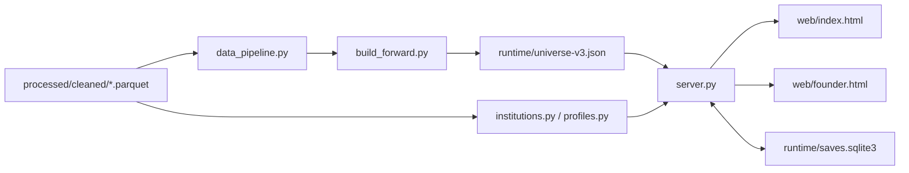

# ESCP 创投模拟器用户手册

本手册依据当前仓库内的全部项目文件编写，范围包括根目录配置、旧版 Demo、当前 `market-simulator` 2.0、Cloudflare Worker、测试与模型产物；`.git/` 属于 Git 内部数据，未列入项目代码。仓库里有两套能够分开理解的系统：`market-simulator/` 是当前 2.0，采用历史快照、确定性规则和 SQLite 存档；`demo/` 是旧版数据与模型演示，页面更丰富，机器学习产物也集中在这里。根目录 Dockerfile 和 Cloudflare 工作流仍然发布旧版 Demo，并不会部署 2.0。

## 一、先弄清两套系统

| 系统 | 入口 | 主要用途 | 当前仓库能否直接运行 |
| --- | --- | --- | --- |
| 2.0 投资人端 | `http://127.0.0.1:8790/` | 浏览企业历史、记录模拟投资成本、推进月份 | 不能；缺少私有 Parquet 和运行快照 |
| 2.0 企业端 | `http://127.0.0.1:8790/founder` | 企业资料、机构池、融资计划、条款与交割 | 不能；与投资人端共用同一后端和私有数据 |
| 旧版 Demo | `http://127.0.0.1:8787/demo/` | 估值、融资预测、投资人匹配、关系图谱、AI 助手 | 可以；模型原始预测文件缺失时会降级 |
| Cloudflare 旧站 | `wrangler.jsonc` 中的域名 | 托管旧版静态页面和 DeepSeek 助手 | 需要 Cloudflare 账户、密钥和 GitHub Secrets |

2.0 的要旨很清楚：历史事实、用户输入和模拟结果分开保存，缺失金额不补默认值，不换算币种，也不把融资额冒充估值。旧版 Demo 则混合了历史统计、手写评分公式与离线模型预测，视觉效果丰富，不过许多数字是筛选参考值，不能视作真实报价或正式投资结论。

## 二、如何运行

### 运行旧版 Demo

当前 Windows 环境有 Python 3.12 和 NumPy；我已实际启动 `scripts/demo_backend.py`，并验证 `/api/status` 与 `/api/simulate` 均能返回成功。建议仍建立独立虚拟环境：

```powershell
cd D:\Learn\Program\ESCP\escp-venture-simulator
py -3.12 -m venv .venv
.\.venv\Scripts\python.exe -m pip install -r requirements.txt
.\.venv\Scripts\python.exe scripts\demo_backend.py
```

浏览器打开：

```text
http://127.0.0.1:8787/demo/
```

本地 AI 助手使用 Gemini，环境变量需在启动进程前设置；代码没有引入 `python-dotenv`，所以把值写进 `.env` 并不会自动生效。

```powershell
$env:GEMINI_API_KEY="你的密钥"
$env:GEMINI_MODEL="gemini-3.6-flash"
.\.venv\Scripts\python.exe scripts\demo_backend.py
```

不配置密钥也能浏览页面。AI 请求失败时，`demo/app.js` 会按关键词调用本地规则回答融资、估值、退出、财务、风险和团队问题。

Docker 运行的仍是旧版 Demo：

```powershell
docker build -t escp-venture-simulator .
docker run --rm -p 8787:8080 escp-venture-simulator
```

若要把 Gemini 环境变量传进容器，可先准备本地 `.env`，再执行：

```powershell
docker run --rm -p 8787:8080 --env-file .env escp-venture-simulator
```

### 运行当前 2.0

仓库没有提交以下文件：

```text
processed/cleaned/investment_events.parquet
processed/cleaned/events_sample_cn.parquet
processed/cleaned/company.parquet
processed/cleaned/employee.parquet
market-simulator/runtime/universe-v3.json
market-simulator/runtime/saves.sqlite3
```

`server.py` 启动时会读取 `runtime/universe-v3.json`；快照不存在便调用 `build_forward.py`，从 Parquet 重建。即使已有快照，机构索引仍需 `investment_events.parquet`，企业概况仍需 `company.parquet` 和 `employee.parquet`。完整使用全部功能，四个 Parquet 都应备齐。

数据准备完成后执行：

```powershell
cd D:\Learn\Program\ESCP\escp-venture-simulator\market-simulator
py -3.12 -m venv .venv
.\.venv\Scripts\python.exe -m pip install -r requirements.txt
.\.venv\Scripts\python.exe server.py
```

浏览器入口：

```text
http://127.0.0.1:8790/
http://127.0.0.1:8790/founder
```

服务只监听 `127.0.0.1`，设计目的就是本机使用；若要公开部署，至少还要补身份认证、TLS、数据库并发与备份方案，直接把它暴露到公网并不稳妥。

### 运行 Cloudflare 旧站

`scripts/build_site.sh` 把 `demo/` 和 `processed/patchtst_metrics.csv` 复制到 `public/`，Worker 再托管这些静态文件。Windows 下宜在 Git Bash 或 WSL 执行：

```bash
bash scripts/build_site.sh
npx wrangler dev
```

线上 AI 助手使用 DeepSeek，并从 Worker Secret 读取 `DEEPSEEK_KEY`；GitHub Actions 还需要 `CLOUDFLARE_API_TOKEN` 与 `CLOUDFLARE_ACCOUNT_ID`。本地 Python 后端使用 Gemini，Cloudflare Worker 使用 DeepSeek，这是两条不同的部署路线。

## 三、网页代码怎样组成

### 2.0 投资人端

入口页面是 [`market-simulator/web/index.html`](market-simulator/web/index.html)，页面本身只有结构和容器，实际行为依赖四个按顺序加载的普通脚本：

```text
index.html
  ├─ app.js       基础状态、API、列表、日志和旧版页面函数
  ├─ trading.js   前向市场、筛选、风险和报价界面
  ├─ evidence.js  覆盖估值式展示，落实“只记成本、不报收益”
  └─ charts.js    最后覆盖组合图，展示开户与逐笔资金变化
```

这些文件没有使用 ES Module，也没有打包器；它们共享 `game`、`render`、`renderMarket`、`showCompany` 等全局变量，并用“保存旧函数、重新赋值”的办法逐层改写行为。例如 `trading.js` 先替换 `renderMarket`，`evidence.js` 随后又替换 `showCompany` 与 `renderPortfolio`，`charts.js` 最后再替换 `renderPortfolio`。顺序一变，最终页面便可能换一套业务口径，因此四个文件不能随意调换或单独删除。

最终生效的投资人端以 `evidence.js` 为准：投资金额只减少账户现金并增加投入成本，不生成股权、公允价值或收益；企业完整历史初始不下发，用户打开详情时才请求 `/api/company`，这能避免一次把数万家企业的全部融资记录送到浏览器。

### 2.0 企业端

[`market-simulator/web/founder.html`](market-simulator/web/founder.html) 定义企业选择器、企业概况、历史融资、机构池、本轮融资和融资方案；[`market-simulator/web/founder.js`](market-simulator/web/founder.js) 独立管理这一页的状态。它并不复用投资人端四个脚本，只与投资人端共享后端账户、Cookie 和 SQLite 存档。

企业端的常用流程如下：

```text
创建或恢复账户
  → 选择历史企业
  → GET /api/company 加载完整历史与机构候选
  → GET /api/company-profile 加载工商和人员快照
  → 搜索机构并加入接触名单
  → 保存融资计划
  → 提交单家申请金额
  → 推进一周获取规则反馈
  → 接受或拒绝情景条款
  → 再推进一周完成模拟到账
```

[`market-simulator/web/styles.css`](market-simulator/web/styles.css) 管投资人端布局、表格、弹窗、资金图和移动端适配；[`market-simulator/web/founder.css`](market-simulator/web/founder.css) 管企业端侧栏、表单、机构卡片、融资时间线和小屏布局。两页均是原生 DOM 操作，没有 React/Vue，也没有 `package.json` 所对应的编译步骤。

### 旧版 Demo

[`demo/index.html`](demo/index.html) 依次加载五份预计算数据、Cytoscape 和 [`demo/app.js`](demo/app.js)：

```text
data.js
model_outputs.js
valuation_model_outputs.js
venture_model_predictions.js
random_forest_tree.js
cytoscape.min.js（CDN）
app.js
```

`data.js` 把约 12 MB 数据挂到 `window.ESCP_DEMO_DATA`；其余模型文件也挂到 `window`。`app.js` 的 `init()` 读取这些全局对象，生成筛选项并调用 `simulate()`，随后由 `renderJourney`、`renderValuation`、`renderInvestorFinance`、`renderInvestors`、`renderNetwork`、`renderDecisionPriorities`、`renderDossier` 和 `renderCompanyAssistant` 分别更新页面模块。

旧版页面的大部分计算都在浏览器执行，`scripts/demo_backend.py` 的 `/api/simulate` 并未被 `demo/app.js` 调用；后端对页面而言主要负责静态文件、`/api/status` 和 `/api/assistant`。若 Cytoscape CDN 无法访问，关系图谱可能不能显示，其余本地模块仍可工作。

## 四、规则算法、统计方法与模型

仓库里的“算法”不止一种，需分清它们从哪里来、有没有训练过程。

| 类别 | 主要文件 | 是否从数据训练 | 实际作用 |
| --- | --- | --- | --- |
| 数据清洗与归并 | `data_pipeline.py`、`build_forward.py` | 否 | 把 Parquet 变成可审计历史快照 |
| 确定性业务规则 | `engine.py`、`evidence_engine.py`、`founder.py`、`financing.py` | 否 | 记账、预算核验、融资状态机、股权计算 |
| 历史统计 | `institutions.py`、`server.py`、`demo/app.js` | 否 | 同业匹配、中位数、分位数、历史转化率 |
| 手写启发式评分 | `demo/app.js`、`scripts/demo_backend.py` | 否 | 估值修正、条件加减分、退出参考、推荐排序 |
| 离线机器学习产物 | `venture_model_predictions.js`、`random_forest_tree.js` | 是，但训练代码缺失 | 下一轮概率、时间、金额及随机森林解释 |
| 时间序列模型产物 | `model_outputs.js`、`valuation_model_outputs.js`、可选 `pred.npy` | 是，但训练代码与主要权重缺失 | PatchTST 指标；本地后端可消费额外预测数组 |
| 外部大语言模型 | `demo_backend.py`、`worker/index.js` | 仓库内不训练 | Gemini 或 DeepSeek 根据页面提供的公司上下文回答问题 |

2.0 基本没有机器学习推理。它更像一本谨慎的账簿：历史数据给事实，规则引擎管操作，缺失之处便留空。旧版 Demo 才有模型产物，不过页面上相当一部分“预测”仍由手写公式得到。

## 五、2.0 算法详解

### 历史数据归并

[`data_pipeline.py`](market-simulator/data_pipeline.py) 从 `investment_events.parquet` 读取融资事件，从 `events_sample_cn.parquet` 读取经营异常事件。金额解析只接受带明确币种的精确表达，正则支持数字、千、万、亿以及 CNY、USD、人民币、美元；范围、模糊金额、未知币种和冲突记录一概保持缺失。

每条融资的可见日按下式处理：

```text
available_date = max(event_date, publication_date)
```

缺少披露日时暂以事件日代替，并标记 `publication_proxy=true`。候选融资按 `(company_id, event_date, stage)` 分组；组内明确金额若只有一个值且没有来源冲突，才写入结果，否则金额为空。估值也只在组内唯一且无冲突时保留。每轮 ID 由企业、日期和轮次的 SHA-256 摘要生成，所以同样输入会得到同样 ID。

[`build_forward.py`](market-simulator/build_forward.py) 把历史截止日设为 `2026-03-31`，增加企业主表中的无融资企业，排除截止日之后才成立的企业，并标记截止日前已经注销或吊销的主体。生成的 v3 快照模拟到 `2029-03-31`，但未来三年不会继续读取真实未来事件。

### 投资账户与成本记账

[`engine.py`](market-simulator/engine.py) 创建账户时保存币种、初始资金、现金、费率、日期、持仓、日志和资金曲线。账户只支持 CNY 或 USD，互不换汇。

成本口径资产的公式是：

```text
投入成本 = Σ 各企业 position.cost
成本口径资产 = 现金 + 投入成本 - 应付管理费
```

[`evidence_engine.py`](market-simulator/evidence_engine.py) 处理当前投资操作。金额必须大于零、不超过现金，且企业不能处于注销或吊销状态；成功后现金减少、该企业成本等额增加，因而投资当时的成本口径资产不变。仓库没有可靠价格和资本结构，公开状态会把 `ownership`、`sim_value`、`unrealized` 等字段改成 `None`，旧存档中的假设值仍保留在原始状态里，却不会被包装成已经核验的收益。

推进月份时：

```text
月管理费 = 初始资金 × 年费率 ÷ 12
本月可支付费用 = min(现金, 原应付费用 + 月管理费)
新应付费用 = 原应付费用 + 月管理费 - 本月支付
```

月份推进只改变日期、费用和日志，不生成随机交易、企业经营、估值上涨或退出收益；36 个月后结束。

### 企业详情与同行金额

`server.py` 初次返回的企业列表是压缩状态，`history` 仅有长度；打开企业后才返回完整历史。同行金额按企业最新一条明确记录计算，筛选条件为同一行业、同一阶段、同一币种，并排除目标企业。样本至少五家时才展示中位数；日期可以不同，所以这个值只是历史金额参考，并非当前估值。

[`profiles.py`](market-simulator/profiles.py) 对企业主表同一字段的多条值取集合：只有一个非空值才展示；多个不同值显示“记录冲突”；没有值显示“未披露”。人员记录根据纳入日、移除日、历史标记和可疑日期标记分类，记录数不能理解为员工总数。

### 机构匹配

[`institutions.py`](market-simulator/institutions.py) 先用 `investor_key_anon` 聚合机构历史，排除来源冲突及同一 ID 对应多个名称的机构。候选机构只使用截止日前可见的历史事件，并计算：

```text
industry_count = 投过的同业企业去重数
stage_count    = 投过的同业且同阶段企业去重数
```

企业详情里的前 20 个候选按 `stage_count`、`industry_count` 降序排列；机构池还支持名称搜索、同业/同阶段过滤，以及相关度、最近披露、投资企业数三种排序。这里没有机器学习，也没有实时机构活跃度或联系方式。

### 融资计划与资金缺口

[`founder.py`](market-simulator/founder.py) 保存用户填写的现金、月净消耗、目标融资额、投前估值、覆盖月数、用途预算与材料状态。资金缺口在前端按下式显示：

```text
资金缺口 = max(0, 月净现金消耗 × 希望覆盖月数 - 可用现金)
```

预算必须满足：

```text
研发预算 + 招聘预算 + 市场预算 + 其他预算 = 融资目标
```

缺少月净消耗会要求补充；`现金 ÷ 月净消耗 > 120` 被视为单位或输入异常。120 个月是产品自身的分析边界，并非市场标准。融资开始后，币种与现金基准不能修改；处理中、待确认或已成交申请存在时，本轮目标和估值也会锁定。全部申请已经拒绝或要求补件时，用户可改目标与估值，旧轮进入归档。

### 企业融资状态机

[`financing.py`](market-simulator/financing.py) 没有随机成功率，其结果完全由状态和输入决定：

```text
submitted（已提交）
  ├─ 找不到该机构的同业投资历史 → rejected
  ├─ 预算或现金消耗核验未通过   → materials
  └─ 条件齐全                   → terms

terms
  ├─ 用户拒绝 → declined
  └─ 用户接受 → accepted → 下一周 → settled
```

申请金额不能超过尚未到账的目标余额；接受条款时还会把所有已接受和已到账额度相加，防止超募。交割只增加企业融资轮中的 `cash` 与 `raised`，不会改变投资人端账户现金，两个账本是分开的。

同轮按固定价格计算股权，原股东被合并成一个整体：

```text
分母 = 投前估值 + 本轮累计到账
原股东合计比例 = 投前估值 ÷ 分母
某机构比例 = 该机构到账金额 ÷ 分母
```

这套公式能演示同轮多机构稀释，却没有还原真实股东、清算优先权、反稀释条款和后续轮次。

### 存档与并发控制

浏览器收到一个 `HttpOnly`、`SameSite=Strict` 的 `market_save` Cookie，Cookie 值只是一段随机会话 ID；完整账户状态作为 JSON 存在 `runtime/saves.sqlite3`。每次写操作必须提交当前 `revision`，后端用 `BEGIN IMMEDIATE` 锁住 SQLite，revision 不一致便返回 HTTP 409 和最新状态，避免两个标签页把彼此的修改静默覆盖。

## 六、旧版 Demo 算法详解

### 阶段识别

`demo/app.js` 用别名表把 Seed、Angel、Pre-A、A+、Series B、Pre-IPO 等不同写法归到统一阶段。企业若有融资日期却没有可识别轮次，页面按独立融资日期数量粗略推断：一条至少天使轮、两条至少 A 轮、三条至少 B 轮、四条至少 C 轮、五条及以上至少 D 轮。这个推断只是界面兜底。

### 分位数

页面把金额转成百万美元，排序后用下标 `round((n-1)×p)` 取 P25、中位数和 P75，没有做线性插值。该方法简单、可重复，小样本时却容易让多个分位数落在同一个观察值上。

### 估值算法

估值优先级是：

```text
目标公司直接估值记录
  → 目标公司融资金额 × 数据倍数
  → 地区/行业/阶段 benchmark
  → 相似融资金额 × 数据倍数
  → 无结果
```

数据倍数依次在“同地区、同行业、同阶段”“同行业、同阶段”“同阶段”“同数据集”四级样本中寻找。估值和融资样本都至少三条时：

```text
原始倍数 = 估值样本中位数 ÷ 融资金额样本中位数
最终倍数 = clamp(原始倍数, 3, 80)
```

样本不足便使用写在 `stageMultipliers` 中的阶段默认倍数。随后还有两次人工修正。

公司历史活动修正为：

```text
activityLift    = min(0.18, log10(事件数+1) × 0.08)
financeLift     = min(0.32, 融资事件数 × 0.055)
networkLift     = min(0.16, 关联方数 × 0.018)
shareholderLift = min(0.12, 股东事件数 × 0.008)
agePenalty      = 无融资时 min(0.18, 活跃跨度年数 × 0.012)
stalePenalty    = 三年以上无事件时 min(0.18, 超出年数 × 0.035)
companyLift     = clamp(前四项 - 后两项, -0.32, 0.48)
```

团队条件修正为：

```text
roleLift   = 有财务负责人 ? +0.04 : -0.03
           + 有销售负责人 ? +0.05 : -0.02
teamLift   = 员工≥30 ? +0.08 : 员工≥12 ? +0.03 : -0.04
runwayLift = runway≥18 ? +0.08 : runway≥12 ? +0.03 : runway<6 ? -0.08 : 0
conditionLift = clamp(roleLift + teamLift + runwayLift, -0.18, 0.22)
```

估值区间的 P25、中位数和 P75 最后同时乘以 `1 + lift`。这些加减分都是前端作者设定的启发式规则，没有从训练集拟合；页面虽然读取 `valuation_model_outputs.js` 的 PatchTST 指标，实际展示的估值仍由上述历史分位数和倍数算法得到。

### 下一轮融资概率

`financingJourney()` 先按当前阶段建立历史公司 cohort。若同行业匹配企业至少 12 家，便只用同行业 cohort；否则退回同阶段总体样本。

```text
基础概率 = 曾进入更高轮次的公司数 ÷ 当前阶段 cohort 公司数
条件修正 = runway≥12 ? +0.04 : runway<6 ? -0.07 : 0
         + 员工≥12 ? +0.03 : -0.03
         + 有财务负责人 ? +0.02 : 0
         + 有销售负责人 ? +0.025 : 0
参考概率 = clamp(基础概率 + 条件修正, 0.03, 0.92)
```

预计下一轮金额取历史上从当前阶段进入更高阶段时，第一笔后续融资金额的 P25、中位数和 P75；预计时间取相邻轮次间隔天数的中位数，没有有效间隔时使用 `finance_interval_baseline`，再没有则默认 540 天。

选中公司已有可验证 A 轮或更高轮次，且 `venture_model_predictions.js` 有对应记录时，历史参考会被离线模型产物替换：24 个月概率直接采用 `next_round_probability_24m`，时间采用 `predicted_days_to_next`，金额区间设为模型金额的 `0.7× / 1.0× / 1.35×`。已经上市或并购的企业被视为终局，下一轮概率、时间和金额归零。

IPO 与并购参考值仍是手写公式：

```text
progress = 当前阶段下标 ÷ (阶段总数 - 2)
IPO 概率 = clamp(0.012 + progress×0.055 + 条件修正×0.18, 0.005, 0.12)
并购概率 = clamp(0.09 + progress×0.09 + 条件修正×0.25, 0.04, 0.26)
```

若数据中已有上市或并购事实，相应概率直接设为 1。两项相加被页面称为“成功退出概率”，其中并未建模竞争风险，因而只能用于相对筛选。

### 融资曲线与退出价值

未来第一阶段概率采用下一轮概率；更后阶段使用 cohort 中到达该阶段的历史比例，样本不足时按每阶段 `0.68` 衰减。代码又强制后续阶段概率不能高于前一阶段。

未来融资额以预测中位数为起点，每进一阶段乘 `1.35`；阶段估值优先使用直接估值，否则为融资额乘阶段默认倍数。为了让图线单调上升，历史段最低增长率为 8%，未来段最低增长率为 22%，退出价值至少是最后一轮估值的 1.35 倍。这些“增长地板”服务于可视化故事线，并非训练模型输出。

另一张 24 个月估值故事线以当前中位估值为基准，历史起点取当前值的 26% 或 34%，未来总增长倍数限制在 1.12 至 1.72 之间，再用幂函数分摊到八个季度。它适合演示趋势，不适合当作财务预测。

### 投资人和伙伴匹配

投资人评分上限 98 分：

```text
中国数据基础分 40；海外数据基础分 34
行业命中 +30
城市命中 +24；只命中国家 +10
阶段命中 +12
历史活跃度 + min(16, log10(投资次数+1)×9)
已配置财务负责人 +4
已配置销售负责人 +3
```

页面取分数最高的三位投资人。伙伴评分同样上限 98：与目标公司已有历史关联加 35，同产业加 35，同地区加 25，同阶段加 15，另加事件活跃度和融资事件数。它们都是规则排序，不是推荐模型。

### 投资回报情景

投资人视角计算：

```text
风险调整融资期望 = 下一轮概率 × 下一轮融资金额
概率调整投后价值 = 当前估值 + 风险调整融资期望
隐含本轮稀释 = 下一轮融资金额 ÷ (当前估值 + 下一轮融资金额)
风险调整退出回款 = 成功退出概率 × 退出价值情景 × 目标持股
预期毛 MOIC = 风险调整退出回款 ÷ 投资本金
```

这里没有计入连续轮次稀释、清算优先权、反稀释、管理费、carry、税费、汇率与时间折现，故只能看成情景算术。

### Python 后端规则模拟

`scripts/demo_backend.py` 的 `/api/simulate` 是另一套计算，目前网页并不调用它。若存在 PatchTST `pred.npy`，程序取数组最后一个目标通道和最后一个预测窗口，以全体目标的中位数为基准、标准差为尺度：

```text
model_score = sigmoid((raw_prediction - median) / standard_deviation)
```

随后根据数据集、行业、城市、员工数、角色、runway、阶段和月份添加人工修正，还用输入内容的 SHA-1 生成稳定相位，加入正弦与余弦波动；最终分数限制在 0.05 至 0.95。融资推进分为：

```text
probability = clamp(
  0.2 + model_score×0.42
  + 团队修正 + 角色修正 + runway修正 + 地区行业修正
  - 阶段衰减,
  0.12,
  0.92
)
```

稳定相位让相同输入每次得到相同曲线，却没有统计学上的概率含义。当前仓库缺少 `external/PatchTST/.../pred.npy`，所以这一接口会用默认 `model_score=0.45` 继续生成规则时间线。

## 七、仓库中的模型

### PatchTST

PatchTST 是一种面向多变量时间序列的 Transformer。标准做法是把每个变量的历史序列切成若干 patch，把 patch 当作 token；各变量独立进入共享权重的 Transformer 编码器，最后由预测头输出未来窗口。切块减少注意力序列长度，也保留一段局部时间模式。原论文见 [A Time Series is Worth 64 Words](https://openreview.net/pdf?id=Jbdc0vTOcol)。

仓库只留下指标与消费逻辑，没有模型定义、训练脚本、超参数全集、数据划分程序或权重：

| 数据集/目标 | 输入长度 | 预测长度 | MSE | MAE | RSE |
| --- | ---: | ---: | ---: | ---: | ---: |
| China / funding_round | 24 | 6 | 0.5374 | 0.3580 | 1.2144 |
| Overseas / funding_round | 36 | 6 | 4010.0178 | 23.4193 | 0.5936 |
| Overseas / valuation_median | 24 | 3 | 2.3414 | 1.0023 | 1.0928 |

指标量纲、归一化、目标定义和测试切分未完整提供，不能仅凭数值比较中外模型优劣。浏览器不直接使用 `model_outputs.js` 生成融资预测；它主要展示指标。Python 后端只有拿到额外 `pred.npy` 时才会消费 PatchTST 数组。

### HistGradientBoosting 与 ExtraTrees

[`demo/venture_model_predictions.js`](demo/venture_model_predictions.js) 保存 165 条公司级离线预测。记录声明概率模型和时间模型为 `HistGradientBoosting`，金额模型为 `ExtraTrees`，总名称为 `Task-specific best ensemble`。训练代码、特征表、参数、交叉验证和模型文件没有进入仓库，所以只能确认预测产物，不能在本仓库复训。

Histogram Gradient Boosting 先把连续特征分箱，再逐轮训练浅树拟合当前损失的负梯度；新树不断修正旧模型残差，分类任务通常优化 log loss，回归任务则优化相应回归损失。仓库没有说明时间任务到底使用哪个具体类及损失函数，故不能进一步断言。算法接口可参见 [scikit-learn HistGradientBoostingClassifier](https://scikit-learn.org/stable/modules/generated/sklearn.ensemble.HistGradientBoostingClassifier.html)。

ExtraTrees 会训练许多高度随机化的回归树，在候选特征上随机抽取切分阈值，再对各树预测取平均；随机阈值能降低树之间的相关性，偏差可能增加，方差通常下降。仓库把它用于下一轮金额预测。官方说明见 [scikit-learn ExtraTreesRegressor](https://scikit-learn.org/stable/modules/generated/sklearn.ensemble.ExtraTreesRegressor.html)。

### 随机森林解释文件

[`demo/random_forest_tree.js`](demo/random_forest_tree.js) 描述一套“未来 24 个月是否出现下一轮融资”的随机森林：400 棵树、154 个训练快照；代表树编号 375，最大深度 6，共 35 个节点和 18 个叶节点。时间外验证记录为 ROC-AUC 0.7868、PR-AUC 0.796、Brier 0.1916，代表树对森林输出的拟合 RMSE 为 0.2031。主要特征包括近两年事件数、历史事件数、关联机构数、平均融资间隔、公司年龄、历史融资轮数、近一年事件数和招聘事件数。

随机森林用随机样本与随机特征训练多棵决策树，分类时由各树投票或平均概率；单棵树从根节点按阈值一路走到叶节点，叶节点的历史正例比例便是该树的概率。原始方法见 Breiman 的 [Random Forests](https://doi.org/10.1023/A:1010933404324)。

页面显示的代表树用于解释特征交互，并展示森林投票的 P10—P90、投票中位数和最终概率。不过公司级 `venture_model_predictions.js` 又把正式概率模型标为 HistGradientBoosting；两份产物显然来自不同模型链路。页面把它们放在同一分析区，容易让使用者误以为代表树解释的正是 HistGradientBoosting 预测，代码并不能证明这一点。

### 外部大语言模型

本地 `scripts/demo_backend.py` 调用 Gemini，Cloudflare `worker/index.js` 调用 DeepSeek。浏览器把当前公司的融资历史、预测、估值、财务、风险、团队与退出状态整理成 JSON，上送给 `/api/assistant`；后端系统提示要求模型只依据这些数据作答，并保留缺失值。大语言模型没有参与 2.0 记账、融资状态机或旧版核心数值计算，它只负责自然语言回答。

## 八、代码如何连在一起

### 2.0 启动链



`server.py` 导入 `evidence_engine`，后者又复用 `engine.py` 的校验、记账和公开状态；企业融资操作依据 action 类型转交 `founder.py` 或 `financing.py`。每次成功写入后，服务把整个状态 JSON 更新到 SQLite，再调用 `public_state()` 删除不应公开的假设值，并把新状态返回浏览器。

### 投资人端请求链

```text
打开 /
  → GET /api/game
  → 恢复 Cookie 对应账户，或显示新建账户表单
  → POST /api/new 创建状态和 Cookie
  → GET /api/company?id=... 按需加载详情
  → POST /api/action {type: offer} 扣现金、加成本
  → POST /api/action {type: advance} 推进月份、计提费用
  → SQLite 保存 revision+1 的状态
```

### 企业端请求链

```text
打开 /founder
  → GET /api/game
  → GET /api/company
  → GET /api/company-profile
  → GET /api/institutions 与 /api/institution
  → POST /api/action {type: founder_contact | founder_plan}
  → POST /api/action {type: financing_submit | financing_week | financing_accept | financing_decline}
  → financing.py 更新企业融资轮和交割账本
  → SQLite 保存
```

### 旧版 Demo 链

```mermaid
flowchart LR
    A[demo/data.js] --> F[demo/app.js]
    B[venture_model_predictions.js] --> F
    C[random_forest_tree.js] --> F
    D[model_outputs.js] --> F
    E[valuation_model_outputs.js] --> F
    F --> G[浏览器估值/融资/匹配/图谱]
    F --> H[/api/status]
    F --> I[/api/assistant]
    I --> J[Gemini 或 DeepSeek]
    I -.失败.-> K[浏览器关键词规则回答]
```

`demo/app.js` 不调用 `/api/simulate`。这个接口可供外部客户端或调试使用，其 PatchTST 条件化算法与浏览器里的 `financingJourney()` 是两套独立实现。

## 九、全部文件索引

### 根目录、部署与数据

| 文件 | 用途 |
| --- | --- |
| [`README.md`](README.md) | 项目总说明，指出 2.0 与旧版入口 |
| [`requirements.txt`](requirements.txt) | 旧版 Python 依赖，仅 NumPy |
| [`.env.example`](.env.example) | Gemini、Host、Port 环境变量样例 |
| [`.gitignore`](.gitignore) | 忽略密钥、虚拟环境、缓存和生成目录 |
| [`.dockerignore`](.dockerignore) | Docker 构建排除项 |
| [`Dockerfile`](Dockerfile) | 打包旧版 Demo Python 服务 |
| [`wrangler.jsonc`](wrangler.jsonc) | Cloudflare Worker、资源与域名配置 |
| [`.github/workflows/deploy.yml`](.github/workflows/deploy.yml) | main 分支的 Cloudflare 自动部署 |
| [`scripts/build_site.sh`](scripts/build_site.sh) | 生成 Worker 使用的 `public/` |
| [`scripts/demo_backend.py`](scripts/demo_backend.py) | 旧版本地服务器、规则模拟和 Gemini API |
| [`worker/index.js`](worker/index.js) | Cloudflare 静态托管、状态与 DeepSeek API |
| [`processed/patchtst_metrics.csv`](processed/patchtst_metrics.csv) | PatchTST 融资预测指标 |

### 旧版 Demo

| 文件 | 用途 |
| --- | --- |
| [`demo/index.html`](demo/index.html) | 旧版页面骨架与脚本加载顺序 |
| [`demo/styles.css`](demo/styles.css) | 旧版全站样式与响应式布局 |
| [`demo/app.js`](demo/app.js) | 页面状态、估值、融资路径、匹配、图谱和 AI UI |
| [`demo/data.js`](demo/data.js) | 约 12 MB 预计算业务数据 |
| [`demo/model_outputs.js`](demo/model_outputs.js) | 融资 PatchTST 指标 |
| [`demo/valuation_model_outputs.js`](demo/valuation_model_outputs.js) | 估值 PatchTST 指标 |
| [`demo/venture_model_predictions.js`](demo/venture_model_predictions.js) | 165 条公司级概率、时间和金额预测 |
| [`demo/random_forest_tree.js`](demo/random_forest_tree.js) | 随机森林结构、特征贡献、路径和验证指标 |

### 2.0 后端

| 文件 | 用途 |
| --- | --- |
| [`market-simulator/README.md`](market-simulator/README.md) | 2.0 规则、边界、运行与验证说明 |
| [`market-simulator/requirements.txt`](market-simulator/requirements.txt) | DuckDB 和 Playwright 版本 |
| [`market-simulator/.gitignore`](market-simulator/.gitignore) | 忽略虚拟环境、runtime 和缓存 |
| [`market-simulator/data_pipeline.py`](market-simulator/data_pipeline.py) | Parquet 清洗、归并和 v2 快照生成 |
| [`market-simulator/build_forward.py`](market-simulator/build_forward.py) | 生成 2026 截止的 v3 前向快照 |
| [`market-simulator/engine.py`](market-simulator/engine.py) | 基础账户、现金、成本、费用和公开状态 |
| [`market-simulator/evidence_engine.py`](market-simulator/evidence_engine.py) | 当前投资规则与未经核验字段屏蔽 |
| [`market-simulator/founder.py`](market-simulator/founder.py) | 融资计划、预算和接触名单 |
| [`market-simulator/financing.py`](market-simulator/financing.py) | 融资申请、评审、条款与交割状态机 |
| [`market-simulator/institutions.py`](market-simulator/institutions.py) | 历史机构索引、匹配、搜索和分页 |
| [`market-simulator/profiles.py`](market-simulator/profiles.py) | 企业主表与主要人员查询 |
| [`market-simulator/server.py`](market-simulator/server.py) | HTTP、Cookie、SQLite、API 与静态文件入口 |

### 2.0 网页

| 文件 | 用途 |
| --- | --- |
| [`market-simulator/web/index.html`](market-simulator/web/index.html) | 投资人端 HTML |
| [`market-simulator/web/app.js`](market-simulator/web/app.js) | 基础浏览器状态和视图函数 |
| [`market-simulator/web/trading.js`](market-simulator/web/trading.js) | 前向市场、筛选、风险与交易展示层 |
| [`market-simulator/web/evidence.js`](market-simulator/web/evidence.js) | 成本口径、懒加载和最终投资展示层 |
| [`market-simulator/web/charts.js`](market-simulator/web/charts.js) | 开户、逐笔投资和现金成本图 |
| [`market-simulator/web/styles.css`](market-simulator/web/styles.css) | 投资人端样式 |
| [`market-simulator/web/founder.html`](market-simulator/web/founder.html) | 企业端 HTML |
| [`market-simulator/web/founder.js`](market-simulator/web/founder.js) | 企业端全部交互与 API 调用 |
| [`market-simulator/web/founder.css`](market-simulator/web/founder.css) | 企业端样式 |

### 测试

| 文件 | 验证内容 |
| --- | --- |
| [`market-simulator/test_evidence.py`](market-simulator/test_evidence.py) | 缺失值、币种、成本配置、月份推进和旧记录隔离 |
| [`market-simulator/test_founder.py`](market-simulator/test_founder.py) | 预算、计划、非法输入和接触名单 |
| [`market-simulator/test_financing.py`](market-simulator/test_financing.py) | 交割、补件、超募、稀释和轮次归档 |
| [`market-simulator/test_institutions.py`](market-simulator/test_institutions.py) | 机构过滤、搜索、分页和截止时间 |
| [`market-simulator/test_revision_browser.py`](market-simulator/test_revision_browser.py) | 懒加载、投资、存档、开户基准和移动端 |
| [`market-simulator/test_founder_browser.py`](market-simulator/test_founder_browser.py) | 企业资料、计划保存、导出和账户隔离 |
| [`market-simulator/test_contacts_browser.py`](market-simulator/test_contacts_browser.py) | 机构详情、搜索、名单和持久化 |
| [`market-simulator/test_financing_browser.py`](market-simulator/test_financing_browser.py) | 完整融资提交、反馈、条款和到账流程 |
| [`market-simulator/test_funding_visual.py`](market-simulator/test_funding_visual.py) | 融资图、缺失金额、币种分离与移动布局 |

## 十、测试方法

准备 DuckDB 依赖后，不需要真实数据便能运行三组纯规则测试：

```powershell
cd market-simulator
.\.venv\Scripts\python.exe -m unittest test_founder test_financing test_institutions -v
```

`test_evidence.py` 需要 `runtime/universe-v3.json`。所有浏览器测试都需要先启动 2.0 服务；代码还硬编码了 `/Applications/Google Chrome.app/...` 这一 macOS Chrome 路径，在 Windows 上应改用 Playwright 自带 Chromium，或改为本机 Chrome 路径后再执行。

## 十一、已知限制

1. 2.0 的私有数据与运行快照没有提交，全新克隆不能直接启动。
2. 机器学习训练代码、完整特征工程、权重和主要 `pred.npy` 没有提交，现有模型无法在仓库内复现。
3. `app.js → trading.js → evidence.js → charts.js` 靠全局函数覆盖组织前端，维护时容易出现口径错位。
4. 旧版估值、IPO、并购、未来估值曲线和推荐排序含大量人工系数，不能统称为机器学习预测。
5. 随机森林解释文件与公司级 HistGradientBoosting 预测来自不同模型链，代表树未必解释页面采用的最终概率。
6. `valuation_model_outputs.js` 只提供指标；页面估值来自历史分位数、倍数和人工修正。
7. 本地后端用 Gemini，Worker 用 DeepSeek；旧版页面在未配置时仍显示“等待配置 DeepSeek API Key”，与本地 Gemini 配置不完全一致。
8. `scripts/demo_backend.py` 的 `/api/simulate` 当前没有被网页调用，网页融资算法和 Python 模拟算法各走一条路。
9. 根目录 Dockerfile 与 Cloudflare 工作流发布旧版 Demo，不会发布 `market-simulator/` 2.0。
10. `demo/data.js` 体积接近 12 MB，首次载入和浏览器解析成本较高；Cytoscape 又依赖外部 CDN。
11. 2.0 存档是本地 SQLite，没有用户登录系统；浏览器 Cookie 丢失后，页面没有现成的存档选择器。
12. 2.0 的成本口径资产没有公允价值含义；旧版 MOIC 则缺少稀释、条款、费用、税与时间折现，两者均不应当作真实投资收益。

这份代码最值得保留的部分，是它在 2.0 中对“已知、未知与模拟”作了明确分隔；最需要继续整理的部分，则是旧版模型产物与手写算法混在同一页面、2.0 前端依赖脚本覆盖顺序，以及缺少能够公开运行的样例数据。若要继续开发，先给 2.0 准备一份脱敏的小型 fixture，再把四个投资人端脚本收束为模块，会比继续增加页面指标更有益。
